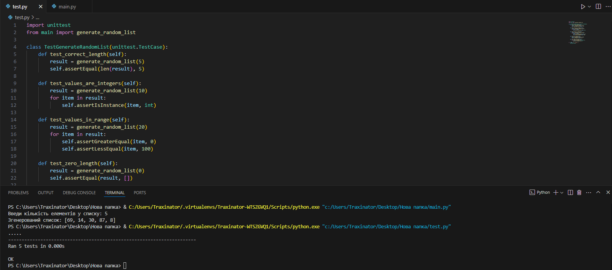

# Екзамен

1. Я створив резозиторій у якому місяться файли:
   - `main.py` — основний файл, у якому міститься функція для індивідуального завдання.
   - `test.py` — файл для написання unit тестів для перевірки роботи функції.

2. У файлі `main.py` створив функцію для виконання індивідуального завдання.

3. У файлі `test.py` написав unit тест для перевірки правильності роботи функції з файлу `main.py`.

4. Запустив програму та тести.

### Запуск програми:

